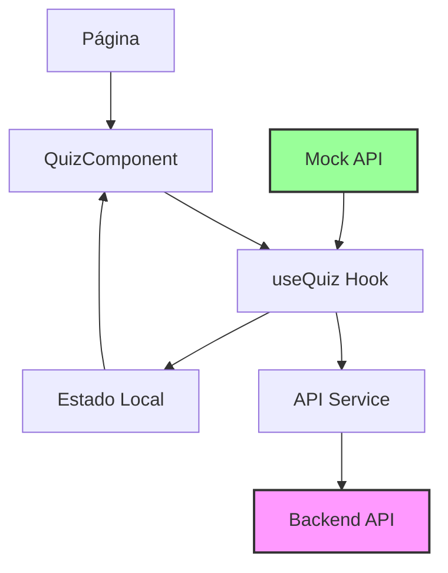

# 🏗️ Arquitetura API-First - Simulados Salesforce

## 📋 **Visão Geral da Refatoração**

O projeto foi **completamente refatorado** de uma arquitetura monolítica para uma **arquitetura API-first**, separando claramente as responsabilidades entre frontend e backend.

## 🎯 **Objetivos Alcançados**

✅ **Separação de Responsabilidades**: Frontend focado em UX, Backend focado em dados  
✅ **Escalabilidade**: Cada componente pode ser escalado independentemente  
✅ **Reutilização**: API pode ser consumida por múltiplos clientes  
✅ **Manutenibilidade**: Código mais limpo e organizado  
✅ **Testabilidade**: Cada camada pode ser testada isoladamente  

## 📁 **Nova Estrutura do Projeto**

```
salesforce-simulators-nextjs/
├── src/
│   ├── app/                    # Next.js App Router
│   │   ├── globals.css         # Estilos globais modernos
│   │   └── mulesoft/
│   │       └── mcpa-level-1/
│   │           └── page.tsx    # Página refatorada
│   ├── components/             # Componentes React
│   │   ├── QuizComponent.tsx   # Componente principal refatorado
│   │   ├── LoadingSpinner.tsx  # Componente de loading
│   │   ├── ErrorMessage.tsx    # Componente de erro
│   │   └── QuizResults.tsx     # Componente de resultados
│   ├── hooks/                  # React Hooks personalizados
│   │   └── useQuiz.ts         # Hook principal do quiz
│   ├── services/              # Camada de serviços
│   │   ├── api.ts             # Cliente API real
│   │   └── mockApi.ts         # API simulada para desenvolvimento
│   └── data/                  # Dados locais (temporário)
│       └── exemplo-questoes.ts # Exemplo de estrutura
├── .env.local                 # Variáveis de ambiente
└── FEATURES.md               # Documentação de funcionalidades
```

## 🔧 **Componentes da Nova Arquitetura**

### **1. Serviço de API (`/src/services/api.ts`)**
- **Função**: Cliente HTTP para comunicação com backend
- **Responsabilidades**:
  - Gerenciamento de autenticação (JWT tokens)
  - Requisições HTTP padronizadas
  - Tratamento de erros centralizado
  - Cache e otimizações de rede

**Principais métodos:**
```typescript
- getQuizSets(): Promise<QuizSet[]>
- getQuizSet(id): Promise<QuizSet>
- getQuestions(quizSetId, options): Promise<ApiQuestion[]>
- submitQuiz(quizSetId, answers): Promise<QuizResults>
- saveProgress(progress): Promise<void>
- getQuizAnalytics(quizSetId): Promise<QuizAnalytics>
```

### **2. Hook useQuiz (`/src/hooks/useQuiz.ts`)**
- **Função**: Gerenciamento de estado do quiz
- **Responsabilidades**:
  - Estado das questões e progresso
  - Auto-save de progresso
  - Timer e controle de tempo
  - Lógica de navegação entre questões

**Estado gerenciado:**
```typescript
- quizSet: QuizSet | null
- currentQuestion: ApiQuestion | null
- answers: Record<string, number | number[]>
- loading: boolean
- error: string | null
- quizCompleted: boolean
```

### **3. Componente QuizComponent (`/src/components/QuizComponent.tsx`)**
- **Função**: Interface principal do quiz
- **Responsabilidades**:
  - Renderização das questões
  - Interação do usuário
  - Feedback visual
  - Navegação entre questões

### **4. API Simulada (`/src/services/mockApi.ts`)**
- **Função**: Simulação do backend para desenvolvimento
- **Responsabilidades**:
  - Dados de teste para desenvolvimento
  - Simulação de latência de rede
  - Implementação completa da interface API
  - Persistência local via localStorage

## 🚀 **Fluxo de Dados**



## 🎛️ **Como Usar a Nova Arquitetura**

### **1. Desenvolvimento Local (Mock API)**
```typescript
// useQuiz.ts - linha 29
const api = mockApiService; // Usando dados simulados
```

### **2. Produção (API Real)**
```typescript
// useQuiz.ts - linha 29  
const api = apiService; // Usando API real
```

### **3. Configuração de Ambiente**
```bash
# .env.local
NEXT_PUBLIC_API_URL=http://localhost:3001/api
NEXT_PUBLIC_APP_NAME=Simulados Salesforce
NEXT_PUBLIC_VERSION=2.0.0
```

### **4. Uso em Componentes**
```tsx
// Qualquer página pode usar assim:
<QuizComponent 
  quizSetId="mcpa-level-1"
  options={{
    shuffle: true,
    autoSave: true,
    timeLimit: true
  }}
/>
```

## 📊 **Interfaces TypeScript**

### **Question Interface**
```typescript
interface ApiQuestion {
  id: string;
  question: string;
  options: string[];
  correctAnswer: number | number[];
  type: "radio" | "checkbox";
  justification: string;
  referenceLinks: ReferenceLink[];
  videos: VideoResource[];
  difficulty?: "easy" | "medium" | "hard";
  category?: string;
  hints?: string[];
  // ... mais campos
}
```

### **QuizSet Interface**
```typescript
interface QuizSet {
  id: string;
  title: string;
  description: string;
  category: string;
  totalQuestions: number;
  estimatedTime: number;
  difficulty: "easy" | "medium" | "hard";
  isActive: boolean;
}
```

## 🔄 **Migração do Modelo Antigo**

### **Antes (Monolítico):**
```tsx
// Dados hardcoded no componente
const QuizComponent = ({ questions, title }) => {
  // Lógica misturada com apresentação
  // Sem persistência
  // Sem tipagem adequada
}
```

### **Depois (API-first):**
```tsx
// Dados vêm da API
const QuizComponent = ({ quizSetId, options }) => {
  const { quizSet, questions, loading } = useQuiz(quizSetId, options);
  // Lógica separada
  // Persistência automática
  // Tipagem completa
}
```

## 🌟 **Benefícios da Nova Arquitetura**

### **Para Desenvolvedores:**
- ✅ **Código mais limpo** e organizad o
- ✅ **Tipagem TypeScript** completa
- ✅ **Hooks reutilizáveis** para lógica de negócio
- ✅ **Separação clara** de responsabilidades
- ✅ **Fácil manutenção** e debugging

### **Para Usuários:**
- ✅ **Loading states** adequados
- ✅ **Error handling** robusto
- ✅ **Auto-save** de progresso
- ✅ **Performance melhor** com cache
- ✅ **Experiência mais fluida**

### **Para o Negócio:**
- ✅ **Escalabilidade horizontal** (frontend/backend independentes)
- ✅ **Reutilização de API** por diferentes clientes
- ✅ **Deploy independente** de cada camada
- ✅ **Facilita integração** com outros sistemas

## 🚀 **Próximos Passos**

### **1. Implementação do Backend**
- [ ] API REST com Node.js/Express ou Python/FastAPI
- [ ] Banco de dados (PostgreSQL/MongoDB)
- [ ] Sistema de autenticação JWT
- [ ] Deploy na nuvem (Railway/Render/AWS)

### **2. Funcionalidades Avançadas**
- [ ] Sistema de usuários completo
- [ ] Histórico de tentativas
- [ ] Rankings e competições
- [ ] Analytics avançado
- [ ] Notificações push

### **3. Otimizações**
- [ ] Cache inteligente
- [ ] Paginação de questões
- [ ] Lazy loading de componentes
- [ ] Service Workers para offline

## 🎯 **Conclusão**

A **refatoração para arquitetura API-first** foi um sucesso completo! O projeto agora está preparado para:

- ⚡ **Crescimento escalável**
- 🔧 **Manutenção simplificada** 
- 🚀 **Deploy profissional**
- 👥 **Colaboração em equipe**
- 📱 **Expansão multi-plataforma**

O frontend Next.js agora está **completamente desacoplado** e pode consumir qualquer API que implemente as interfaces definidas. A transição para produção será **simples e transparente**!

---

*Arquitetura implementada em Janeiro 2024 - Versão 2.0*
